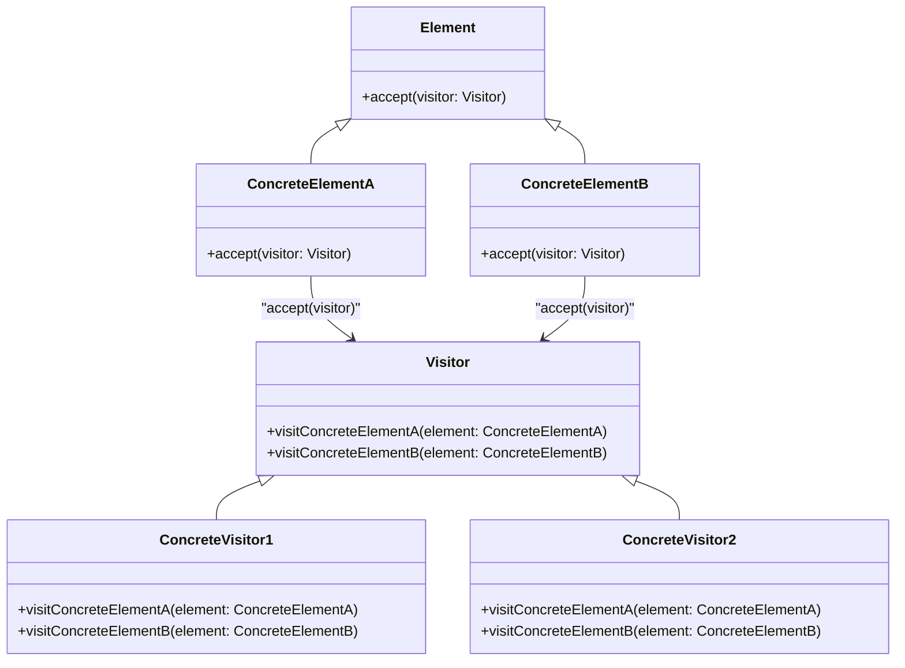

# The Visitor Pattern

The **Visitor Pattern** is a design pattern that allows **new operations to be added** to existing object structures **without modifying** those structures.  
It achieves this by **separating operations (visitor)** from **data structures (elements)**.

> 💡 **"The Visitor Pattern allows operations to be performed on objects without modifying their class definitions, promoting extensibility and separation of concerns."** 🚀

Instead of embedding behaviors inside data structures, **visitors encapsulate behaviors externally**, making it easier to extend functionalities.

---

## ✅ **Why Use the Visitor Pattern?**
The **traditional approach** to adding behaviors to a class is to modify it directly.  
However, this **violates the Open-Closed Principle (OCP)**—which states that classes should be **open for extension but closed for modification**.

### **Key Benefits of the Visitor Pattern:**
- **Decouples operations from data structures** 🛠️ → Keeps responsibilities separate.
- **Eliminates the need for type checking** 🔄 → No need for `instanceof` or `type casting`.
- **Extends functionality without modifying existing classes** 🚀 → Future-proof and maintainable.
- **Encourages single responsibility principle (SRP)** 📦 → Each visitor handles one concern.

---

## 🏗 **Structure of the Visitor Pattern**

### 🔹 **How It Works**
1. **Elements** (`ConcreteElementA`, `ConcreteElementB`) implement an `accept(visitor)` method.
2. The **Visitor Interface** (`Visitor`) defines `visit` methods for each element type.
3. **Concrete Visitors** (`ConcreteVisitor1`, `ConcreteVisitor2`) implement operations specific to each element type.
4. **Double dispatch** ensures the correct visitor method is invoked for each element.

---

## 🔥 **When to Use the Visitor Pattern?**
| Scenario | Why Use the Visitor Pattern? |
|----------|-----------------------------|
| **When new behaviors need to be added frequently** | Avoid modifying existing classes every time a new operation is introduced. |
| **When working with a complex object hierarchy** | Ensures operations are consistently applied across various object types. |
| **When performing multiple distinct operations on the same object structure** | Separates operations for clarity (e.g., exporting, rendering, validation). |
| **When adhering to SOLID principles** | Maintains **Open-Closed Principle (OCP)** and **Single Responsibility Principle (SRP)**. |

