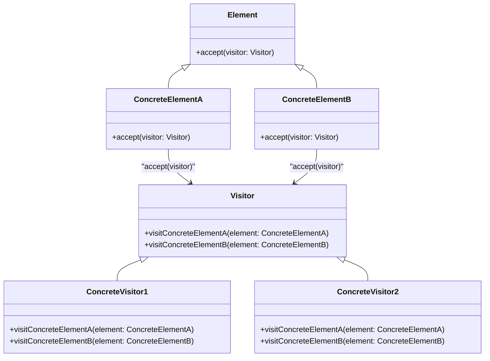

# The Visitor Pattern

The visitor pattern is a design pattern used to organize operations on data structures.

> 💡 **"The Visitor Pattern separates operations from data structures, enabling extensibility of operations without modifying existing hierarchies."** 🚀

As there are many variations of the visitor pattern for sub-problems and programming styles, we will focus on a more practical variation.

## Double Dispatch Visitor Pattern

The **double dispatch pattern** is a variation of the visitor pattern that allows the visitor to call the correct method based on the type of the visited object.  
It helps to avoid type checking and casting in the visitor implementation and avoids coupling to the data types.

### 📌 Key Benefits:
- Eliminates the need for explicit type checking (`instanceof` or `type casting`).
- Decouples operations from data structures.
- Allows extending behavior without modifying existing class hierarchies.

As theory is always hard without practice, I keep further explanations for the next sections. 
I also find it a bit meaningless to explain theory that is well documented. The internet is full of resources on the visitor pattern, and I want to focus on the practical side.
